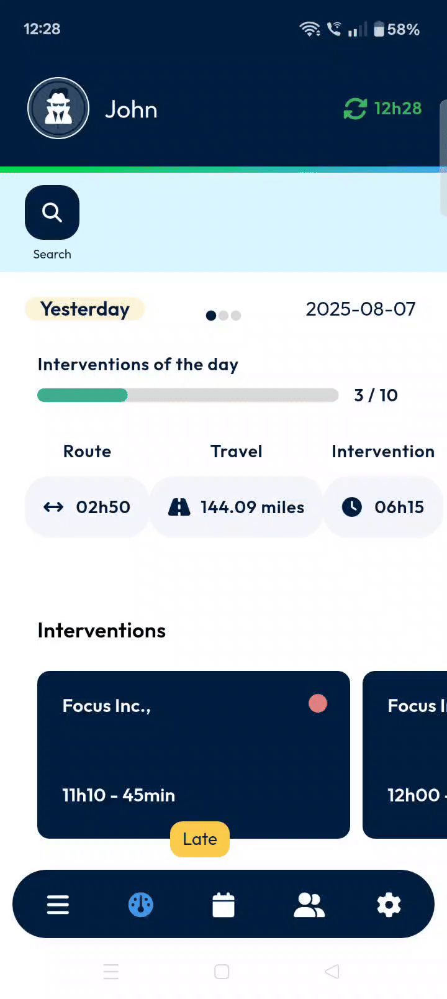

# Cancel

### 1. Getting Started

Please note that this guide focuses specifically on the "Cancel Intervention" feature. Information regarding system requirements, installation steps, or initial configuration for TourSolver Mobile is not available in the provided sources \[i, j].

### 2. Understanding Interventions and Cancellation

In TourSolver Mobile, an "intervention" refers to a task or activity you need to complete. Sometimes, circumstances change, and you might need to cancel or an intervention you've started or were about to begin. This guide will walk you through the simple steps to do just that.

### 3. Cancelling an Intervention

Before you start a new intervention or cancel an existing one, it's crucial to ensure that you have completed any interventions currently marked as "in progress". You must finish all ongoing interventions before moving on to the next one.

Here’s how to abandon an intervention in TourSolver Mobile:

1. **Access the Intervention from Your Dashboard**
   * To begin, you need to open the specific intervention you wish to abandon.

2\. **Locate and Tap the Abandon Button** \* Once you've opened the intervention, if you decide to cancel it, look for the dedicated button.

 (1).jpg>)

3\. **Confirm the Cancellation**\* After tapping the cancel button, a pop-up window will appear on your screen to confirm your action. This is a safety measure to prevent accidental abandonments.

.jpg>)

4\. **Verify Cancellation**\* Once you confirm, the system will process your request.

.jpg>)

### 4. Productivity Tips

Specific productivity tips beyond the "Cancel Intervention" process are not provided in the source materials for this guide \[i, j]. However, efficiently using the "Cancel" feature as described above helps keep your dashboard tidy and accurately reflects your current workload.
